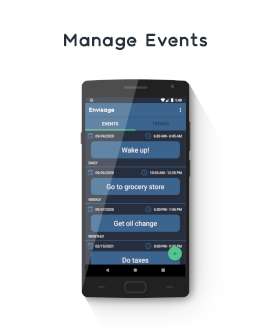
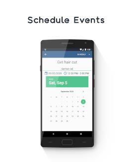
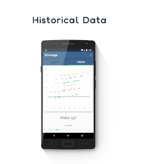

<a href='https://play.google.com/store/apps/details?id=com.apps.creativesource.envisage&pcampaignid=pcampaignidMKT-Other-global-all-co-prtnr-py-PartBadge-Mar2515-1'></a>

**The problem with most mobile reminder apps is that they are a dime a dozen. They all do virtually the same things and do not offer the user nearly enough support in planning their schedules.**

**What’s the use of a scheduling assistant if you must micromanage all of your assistant’s duties for them? In a case such as this, you may as well not even have an assistant. Reminder apps have traditionally required the user to consider all of their currently scheduled appointments in order to effectively schedule a new appointment - even if the user has scheduled and followed through on a limited number of similar events, at relatively similar times. These less than intelligent apps repeatedly place all of the effort in selective scheduling on the user of the application.**

**Envisage seeks to solve this problem by actively participating in the user’s scheduling process.**

**Instead of simply relying on the user to consider everything in order to formulate a daily routine, Envisage learns from trends in the historical scheduling and makes recommendations and provides visualizations to lend a hand in the decision-making process the user engages in. The app will keep track of similar names events that the user has scheduled locally on the device. The most important characteristics of past events that will be used in providing useful insights are a time of day and duration. Therefore, once a user begins to use the app, schedule events, and follow through on those events, data regarding when a specific event was initiated as well as how long that event lasted will be considered when the user next schedules that same event.**

**This all makes for a dynamic and pleasant mobile reminder experience. solve this problem by actively participating in the user’s scheduling process.**



## Built With

* [HorizontalPicker](https://github.com/adityagohad/HorizontalPicker) - Customizable horizontal picker library
* [SQLCipher](https://github.com/sqlcipher/android-database-sqlcipher) - SQLite encryption wrapper library
* [MPAndroidChart](https://github.com/PhilJay/MPAndroidChart) - Android chart-view/graph-view library

## License

```
All Rights Reserved
```
